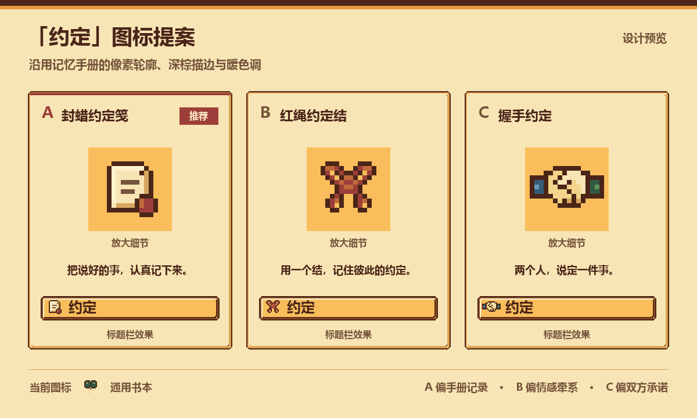

# “约定”图标设计草稿

用于选择“记忆”页中“约定”标题左侧的独立图标。

| 方案 | 含义 | 设计取向 |
| --- | --- | --- |
| A · 封蜡约定笺（推荐） | 写下并认真记住的承诺 | 暖纸色搭配红蜡封记，与手册材质呼应 |
| B · 红绳约定结 | 用绳结记住彼此的约定 | 温暖、偏情感牵系 |
| C · 握手约定 | 双方共同说定的一件事 | 直观、偏双方承诺 |



每个图标为 16×16 RGBA 透明像素图，在现有标题栏中按 32×32 显示。
颜色来自现有 `tools/generate_memory_book_ui.py`；图标通过对应 JSON 像素图重建。
比较图使用仓库现有标题栏素材与系统中文字体，不含玩家截图。

这些文件仅用于设计评审。选定后再接入“约定”标题；当前运行时图集与 UI 代码保持原样。

## 重新生成

需要 Python 3.10+、Pillow 和中文字体。从仓库根目录执行：

```powershell
python docs/design/memory-book-promise-icon/render_preview.py
```

默认使用 Windows 微软雅黑粗体。其他环境可以通过 `--font /path/to/chinese-font.ttf` 指定字体。
